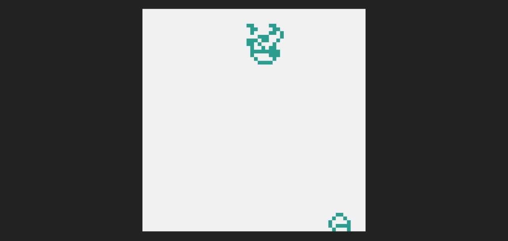

# LangstonAnt.js

> Classical Langton's ant with wall collitions

Langton's ant is a two-dimensional universal Turing machine with a very simple set of rules but complex emergent behavior. It was invented by Chris Langton in 1986 and runs on a square lattice of black and white cells.

- (Extracted from [Wikipedia](https://en.wikipedia.org/wiki/Langton%27s_ant))

## Example

